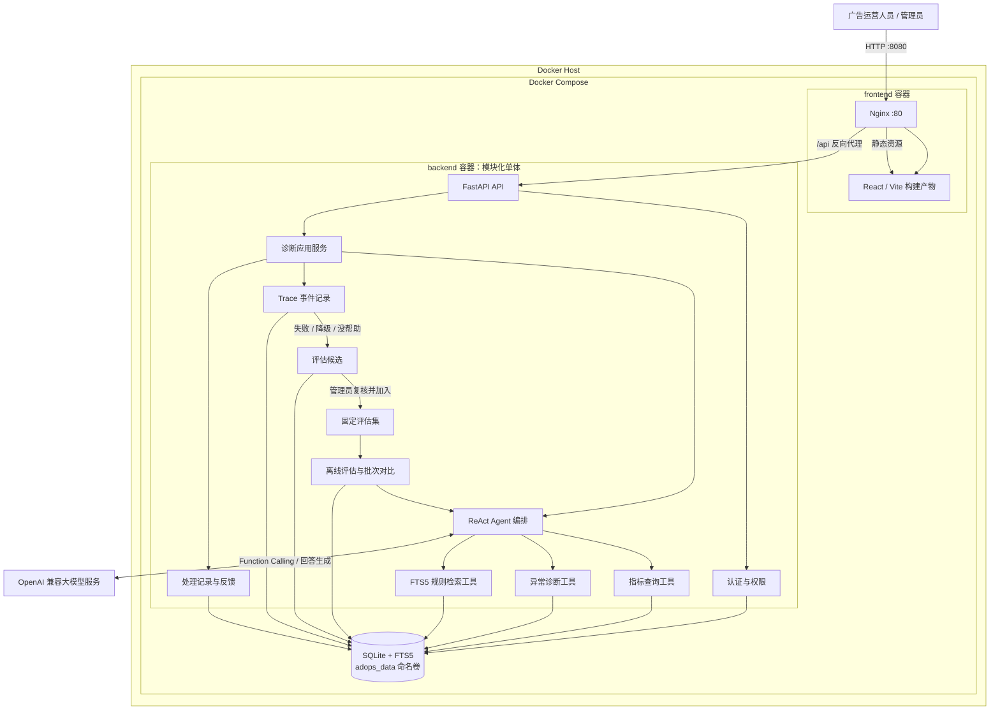
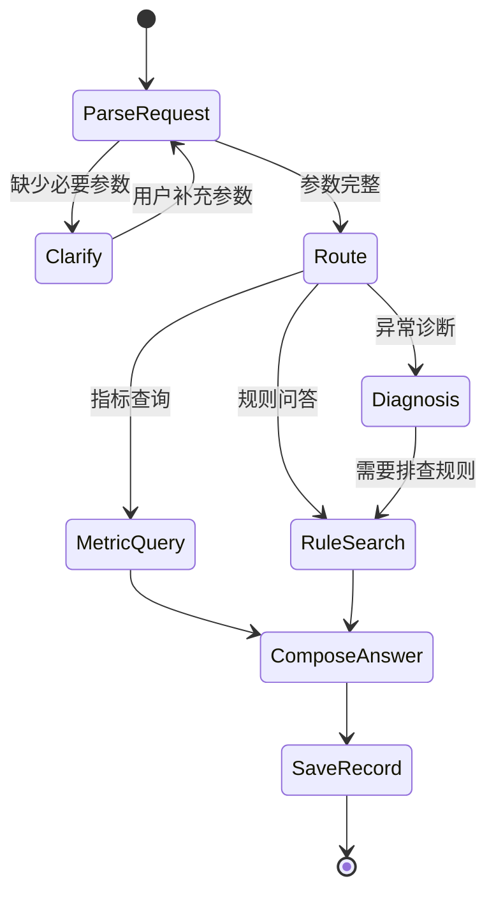
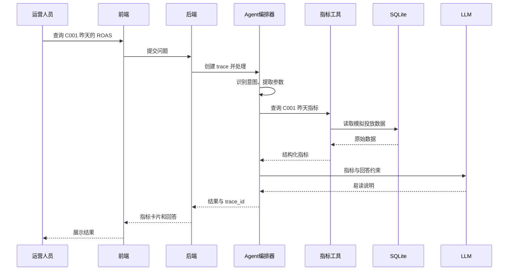
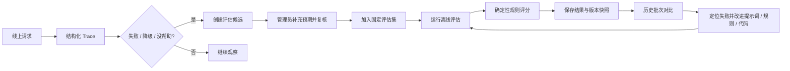

# AdOps Support Copilot 系统架构设计 V1.0

> 状态：第一版架构基线  
> 面向用户：内部广告运营人员、系统管理员  
> 核心定位：只读型广告指标查询与异常诊断系统  
> 架构原则：前后端分离、模块化单体、确定性计算优先、回答可追溯

## 1. 架构目标

第一版需要支持六个业务场景：

1. 指标查询。
2. 异常诊断。
3. 规则问答。
4. 参数澄清。
5. 处理记录查询。
6. 离线评估。

同时满足以下约束：

- 所有广告数据均为模拟数据。
- 所有已登录运营人员都能查看全部广告主数据。
- 普通运营人员只能查看自己的处理记录，管理员可以查看全部记录。
- 系统只提供分析和建议，不修改广告计划。
- 只保留参数澄清所需的短期多轮状态。
- 第一版需要登录和管理页面。
- 第一版不提供知识编辑和处理记录删除功能。
- 永久不建设工单系统。

## 2. 总体架构



### 2.1 架构形态

前端和后端分别作为两个独立应用：

- 前端负责页面、交互、表单校验和结果展示。
- 后端负责身份验证、业务规则、Agent 流程、数据访问和评估。
- 前后端只通过约定的 HTTP JSON 接口通信。
- 前端不能直接访问数据库和大模型服务。
- 大模型密钥只能保存在后端环境变量中。

### 2.2 部署与请求入口

- Docker Compose 统一编排 `frontend` 和 `backend` 两个容器。
- 前端镜像使用多阶段构建：Node.js 负责生成静态文件，Nginx 负责托管页面。
- 浏览器只访问 Nginx 的 `8080` 端口；Nginx 将 `/api` 请求反向代理到 Docker 内部的 `backend:8000`。
- SQLite 与 FTS5 数据保存在 `adops_data` 命名卷，容器重启或重新创建后仍可保留。
- 后端的 `8000` 端口额外暴露用于本地调试和查看 OpenAPI 文档，生产部署时可按需取消。

后端第一版采用“模块化单体”，即一个后端进程内按职责划分模块，而不是拆成微服务。第一版的数据量、用户量和开发周期都不需要微服务。

## 3. 核心设计决策

### 3.1 使用单 Agent 编排，不使用多 Agent

第一版只有一个 Agent 编排器，负责：

1. 理解用户意图。
2. 提取业务参数。
3. 检查参数是否完整。
4. 决定调用哪个业务工具。
5. 汇总工具结果并生成最终回答。

指标计算、异常判断和知识检索是普通的确定性工具，不分别包装成多个 Agent。

这样能够减少：

- 不必要的大模型调用。
- 多 Agent 之间的状态同步。
- 调试难度。
- Token 消耗和响应时间。

### 3.2 数值计算和异常判断不交给大模型

大模型负责：

- 理解自然语言。
- 提取广告主、广告计划、日期范围等参数。
- 选择业务工具。
- 根据结构化结果生成易读说明。

后端代码负责：

- 查询原始数据。
- 计算 CTR、CVR、CPC、CPA、ROAS（广告投产比）。
- 按模拟业务规则判断异常。
- 控制用户权限。
- 保存处理记录和评估结果。

这保证同一份数据得到稳定、可测试的数值结果。

### 3.3 第一版使用 SQLite FTS5 检索规则

知识库规模较小，第一版使用 SQLite FTS5 完成关键词检索和相关性排序，不引入 Qdrant 和 Embedding 服务。

系统需要保存每个知识片段的：

- 来源编号。
- 文档标题。
- 小节标题。
- 文本内容。
- 适用的问题类型。

回答中只展示实际检索到的来源，不允许生成不存在的来源编号。

### 3.4 Trace 记录决策，不记录隐藏推理

每次请求生成唯一 `trace_id`，记录可观察到的业务事件：

- 原始问题。
- 识别出的意图。
- 提取的参数。
- 缺失参数。
- 调用的工具。
- 工具输入和输出摘要。
- 检索到的知识来源。
- 各阶段耗时。
- 错误和降级结果。
- 最终回答。

系统不要求保存大模型隐藏的思维链，只保存能够用于排错和评估的结构化事实。

### 3.5 短期多轮只服务于参数澄清

当用户信息不足时，后端保存一个短期会话状态：

```text
原始任务 + 已提取参数 + 缺失参数 + 当前状态
```

首次提问时立即创建处理记录；澄清期间持续更新同一条记录，不重复创建记录。会话 30 分钟过期。当参数补齐、用户取消、用户明确开始新任务或会话过期时结束该状态。第一版不建设用户画像、长期记忆或开放式聊天记忆。

## 4. 前端架构

### 4.1 前端职责

前端负责：

- 登录和退出。
- 保存当前登录状态。
- 输入自然语言问题。
- 处理参数澄清交互。
- 展示指标卡片、诊断结论、建议和知识来源。
- 展示处理记录。
- 提交“有帮助/没帮助”反馈。
- 为管理员展示用户、Trace 和评估页面。

前端不负责：

- 计算广告指标。
- 判断广告异常。
- 拼接大模型提示词。
- 直接调用大模型。
- 自行决定用户权限。

### 4.2 页面划分

```text
登录页

运营人员区域
├─ 广告诊断页
├─ 我的处理记录
└─ 处理记录详情

管理员区域
├─ 系统概览
├─ 用户管理
├─ 全部处理记录
├─ Trace 详情
├─ 离线评估
├─ 评估批次详情/对比
└─ 知识来源查看
```

### 4.3 广告诊断页

页面包含：

- 广告主和广告计划的可选筛选项。
- 自然语言问题输入框。
- 参数澄清区域。
- 指标卡片。
- 异常事实、可能原因和建议。
- 知识来源列表。
- Trace 编号。
- “有帮助/没帮助”按钮。

复杂趋势图、报表设计器和拖拽大屏不进入第一版。

## 5. 后端模块

### 5.1 API 接入模块

职责：

- 接收前端请求。
- 完成输入格式校验。
- 获取当前用户。
- 调用对应应用服务。
- 返回统一格式的结果或错误。

### 5.2 认证与权限模块

职责：

- 登录、退出和当前用户查询。
- 密码安全校验。
- 管理登录会话。
- 用户修改自己的密码。
- 管理员重置其他用户的密码。
- 区分运营人员和管理员。
- 拒绝越权访问。

权限规则：

| 能力 | 运营人员 | 管理员 |
|---|---:|---:|
| 查看全部模拟广告主数据 | 是 | 是 |
| 使用指标查询和异常诊断 | 是 | 是 |
| 查看自己的处理记录 | 是 | 是 |
| 查看其他人的处理记录 | 否 | 是 |
| 提交回答反馈 | 是 | 是 |
| 管理用户 | 否 | 是 |
| 发起离线评估 | 否 | 是 |
| 查看全部评估结果 | 否 | 是 |
| 查看知识来源 | 是 | 是 |
| 修改知识内容 | 否 | 否 |

### 5.3 Agent 编排模块

编排器使用显式状态流程，不让大模型自由循环调用工具：



第一版设置固定的最大步骤数，避免大模型发生无限工具调用。

### 5.4 指标查询工具

输入：

- 广告主标识，可选。
- 广告计划标识。
- 开始日期。
- 结束日期。
- 指标列表，可选。

输出：

- 查询范围。
- 汇总后的原始数值。
- 计算指标。
- 数据是否存在。

核心指标定义：

```text
CTR = 点击量 / 曝光量
CVR = 转化量 / 点击量
CPC = 消耗 / 点击量
CPA = 消耗 / 转化量
ROAS = 转化收入 / 消耗
```

分母为零时返回“不可计算”及原因，不返回无穷大或伪造数值。

### 5.5 异常诊断工具

职责：

- 接收结构化指标结果。
- 使用模拟业务规则判断异常。
- 返回命中的规则、事实和排查建议。

输出应明确区分：

- `facts`：由数据直接确认的事实。
- `anomalies`：命中的异常规则。
- `possible_causes`：需要进一步验证的可能原因。
- `suggestions`：只读的处理建议。

异常阈值统一由后端配置，前端不能自行判断。

### 5.6 规则检索模块

职责：

- 接收检索问题。
- 在知识片段中执行全文检索。
- 返回最相关的少量片段。
- 返回真实来源编号和标题。

未检索到可靠内容时，返回“没有可靠知识依据”，不要求大模型补全答案。

### 5.7 Trace 与处理记录模块

Trace 面向排错，处理记录面向用户查看：

- Trace 保存系统每个阶段的结构化事件。
- 处理记录保存用户能理解的问题、结果、来源和状态。
- 二者通过同一个 `trace_id` 关联。

普通用户只能查看自己的处理记录；管理员可以查看全部处理记录及其 Trace。

### 5.8 用户反馈模块

每条已完成的处理记录允许当前用户提交：

- `helpful`
- `not_helpful`

同一用户对同一记录只保留一份当前反馈，允许覆盖之前的选择。反馈只用于统计和后续评估，不自动修改知识和提示词。

### 5.9 离线评估模块

管理员手动创建评估批次。后端按固定测试集执行，并保存：

- 批次状态。
- 每条用例的输入和预期结果。
- 系统实际输出。
- 规则评分结果。
- 可选的自然语言质量评分。
- 失败原因。
- 耗时。

第一版优先采用确定性评分：

- 意图是否一致。
- 参数是否一致。
- 是否正确发起澄清。
- 指标计算是否一致。
- 异常规则是否命中。
- 来源编号是否正确。

只有无法通过规则判断的自然语言质量，才使用 LLM Judge 辅助评分。评估任务在后端进程内运行，不引入消息队列和分布式任务系统。

## 6. 数据架构

第一版使用一个 SQLite 数据库，至少包含以下业务数据：

| 数据对象 | 用途 |
|---|---|
| 用户 | 登录身份与角色 |
| 登录会话 | 保存有效登录状态 |
| 广告主 | 模拟广告主资料 |
| 广告计划 | 模拟广告计划资料 |
| 每日投放数据 | 曝光、点击、消耗、转化、收入 |
| 知识文档 | 知识来源基本信息 |
| 知识片段 | FTS5 检索内容 |
| 澄清会话 | 短期任务和缺失参数 |
| 处理记录 | 用户问题和最终业务结果 |
| Trace 事件 | 各阶段的结构化执行信息 |
| 用户反馈 | 有帮助/没帮助 |
| 评估批次 | 一次离线评估的汇总 |
| 评估用例 | 固定问题和预期结果 |
| 评估结果 | 单条用例的实际输出和评分 |

处理记录和评估记录第一版只允许新增和查询，不提供前端删除入口。

## 7. API 边界

以下是业务级接口边界，具体字段在下一阶段定义。

### 7.1 认证

```text
POST /api/auth/login
POST /api/auth/logout
GET  /api/auth/me
POST /api/auth/change-password
```

### 7.2 广告数据

```text
GET /api/advertisers
GET /api/advertisers/{advertiser_id}/campaigns
GET /api/campaigns/{campaign_id}/metrics
```

### 7.3 Agent 诊断

```text
POST /api/assistant/messages
POST /api/assistant/sessions/{session_id}/messages
```

同一个消息接口同时承载指标查询、异常诊断、规则问答和参数澄清。

### 7.4 处理记录和反馈

```text
GET  /api/records
GET  /api/records/{record_id}
POST /api/records/{record_id}/feedback
```

### 7.5 管理功能

```text
GET   /api/admin/overview
GET   /api/admin/users
POST  /api/admin/users
PATCH /api/admin/users/{user_id}/status
POST  /api/admin/users/{user_id}/reset-password
GET   /api/admin/records
GET   /api/admin/traces/{trace_id}
GET   /api/admin/knowledge-sources
```

### 7.6 离线评估

```text
POST /api/admin/evaluations
GET  /api/admin/evaluations
GET  /api/admin/evaluations/{batch_id}
GET  /api/admin/evaluations/compare?left={id}&right={id}
```

## 8. 关键请求流程

### 8.1 指标查询



### 8.2 参数澄清

```text
用户：帮我分析为什么 ROAS 很低
  ↓
识别为异常诊断
  ↓
缺少 campaign_id、date_range
  ↓
保存短期澄清状态
  ↓
返回缺失参数问题
  ↓
用户：C001，昨天
  ↓
合并已有参数并继续诊断
```

### 8.3 异常诊断

```text
结构化参数
  ↓
查询原始数据并计算指标
  ↓
确定性异常规则判断
  ↓
根据异常类型检索排查知识
  ↓
LLM 组织“事实—可能原因—建议—来源”
  ↓
保存 Trace 和处理记录
```

### 8.4 离线评估



闭环中的人工复核是质量门禁：Trace 不会自动变成标准答案，只有管理员确认过输入、意图、工具和关键结果后，样本才会进入正式评估集。

## 9. 异常与降级策略

| 异常情况 | 第一版处理方式 |
|---|---|
| 用户未登录 | 返回未认证状态，前端跳到登录页 |
| 用户越权 | 拒绝访问并记录安全事件 |
| 广告计划不存在 | 明确提示未找到，不调用 LLM 猜测 |
| 日期范围无数据 | 返回无数据及实际查询范围 |
| 参数缺失 | 进入短期澄清流程 |
| 知识检索无结果 | 明确说明没有可靠知识依据 |
| 大模型解析失败 | 返回可重试提示并记录 Trace |
| 工具执行失败 | 返回受控错误，不展示内部堆栈 |
| 工具成功但回答生成失败 | 使用结构化指标和固定模板降级回答 |
| 评估用例失败 | 保存失败原因，继续执行剩余用例 |

## 10. 建议的项目目录

目录只表达前后端和职责边界，具体文件在实现阶段按实际需要创建。

```text
AdOps Support Copilot/
├─ frontend/                 # 独立前端应用
│  └─ src/
│     ├─ api/                # 后端接口调用
│     ├─ views/              # 登录、诊断、记录、管理页面
│     ├─ components/         # 指标卡片、来源、反馈等复用组件
│     └─ router/             # 页面路由和权限检查
├─ backend/                  # 独立后端应用
│  ├─ app/
│  │  ├─ api/                # HTTP 接口
│  │  ├─ agent/              # 意图、参数和显式编排流程
│  │  ├─ tools/              # 指标、诊断和规则检索工具
│  │  ├─ services/           # 认证、记录、Trace、评估服务
│  │  ├─ db/                 # SQLite 初始化和数据访问
│  │  └─ main.py             # 后端入口
│  ├─ data/                  # 模拟数据、知识文档和评估集
│  └─ tests/                 # 关键业务测试
├─ ARCHITECTURE.md           # 本架构文档
├─ README.md                 # 运行与演示说明
└─ .env.example              # 配置示例，不包含真实密钥
```

实现时不会为了对应目录而提前创建空模块；只有实际需要的文件才会加入。

## 11. 第一版不采用的架构

- 不拆微服务。
- 不使用多 Agent。
- 不引入消息队列。
- 不引入 Redis。
- 不引入 Qdrant。
- 不引入 Neo4j。
- 不建设长期记忆。
- 不建设工单服务。
- 不直接连接真实广告平台。
- 不允许大模型执行数据修改。
- 不建设复杂前端数据大屏。

这些能力只有在出现明确业务需求或当前方案遇到可测量瓶颈时才考虑。

## 12. 架构验收检查

进入代码实现后，需要通过以下检查证明架构落地：

- 前端不包含数据库和大模型密钥。
- 前端只能通过后端接口读取业务数据。
- 未登录请求无法访问业务接口。
- 运营人员不能查看其他用户的处理记录。
- 所有运营人员可以查看全部模拟广告主数据。
- 指标由确定性代码计算并有测试覆盖。
- 参数不完整时不会直接执行诊断。
- 回答引用的来源能够在知识库中找到。
- 每次处理都有 `trace_id`。
- 大模型失败后仍能返回受控结果。
- 普通用户不能发起离线评估。
- 评估批次结果可以保存和比较。
- 系统没有任何修改广告计划的入口。

## 13. 下一阶段

架构确认后，按以下顺序继续：

1. 定义数据库业务对象和字段。
2. 定义前后端 API 请求与响应契约。
3. 确定模拟数据和异常规则。
4. 创建最小前后端项目骨架。
5. 先完成“登录 + 指标查询”纵向闭环。
6. 再依次增加异常诊断、规则问答、Trace 和离线评估。

每增加一个非简单业务分支，都需要保留一个最小可运行测试。
