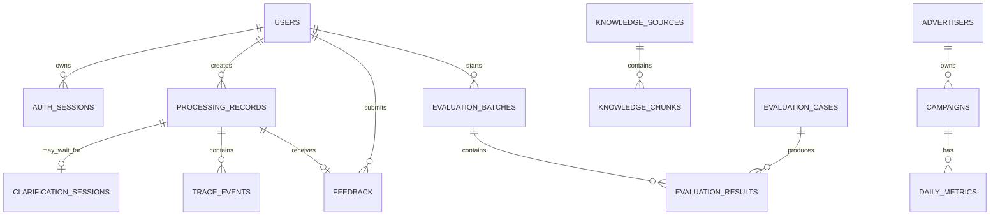

# AdOps Support Copilot 数据模型与 API 契约 V1.0

> 上游文档：[ARCHITECTURE.md](./ARCHITECTURE.md)  
> 本文用途：在编码前统一后端数据边界和前后端通信格式  
> 本阶段不创建数据库，也不实现接口

## 1. 统一约定

### 1.1 命名

- 数据库表和字段使用 `snake_case`。
- JSON 字段使用 `snake_case`。
- 数据库内部主键统一命名为 `id`。
- 面向用户展示的广告主和广告计划使用独立业务编号，例如 `ADV001`、`CMP001`。
- `trace_id` 使用不可预测的唯一字符串，不使用连续数字。

### 1.2 日期和时间

- 广告统计日期使用 `YYYY-MM-DD`，业务时区为 `Asia/Shanghai`。
- 系统时间使用带时区的 ISO 8601 格式，例如 `2026-09-09T02:30:00Z`。
- API 中的日期范围包含开始日期和结束日期。
- `start_date` 不能晚于 `end_date`。

### 1.3 金额、百分比和比率

- 数据库中的金额使用整数分，避免浮点误差，例如 `128050` 表示 `1280.50 CNY`。
- API 返回金额时使用 `*_cents`，由前端格式化成人民币。
- CTR、CVR 使用小数表示，例如 `0.02` 表示 `2%`。
- ROAS（广告投产比）使用比率表示，例如 `1.82` 表示投入 1 元广告费产生 1.82 元转化收入。第一版不把它称为 ROI，也不计算需要完整成本数据的净 ROI。
- 分母为零时，对应指标返回 `null`，同时返回不可计算原因。

### 1.4 分页

列表接口统一接受：

```text
page：从 1 开始，默认 1
page_size：默认 20，最大 100
```

统一返回：

```json
{
  "items": [],
  "page": 1,
  "page_size": 20,
  "total": 0
}
```

### 1.5 删除策略

第一版不提供以下数据的页面删除和 API 删除入口：

- 处理记录。
- Trace 事件。
- 用户反馈。
- 评估批次和评估结果。
- 知识文档和知识片段。

用户采用启用/停用状态，不通过页面物理删除。

## 2. 数据对象关系



## 3. 数据表定义

### 3.1 `users`：内部用户

| 字段 | 类型 | 约束 | 说明 |
|---|---|---|---|
| `id` | INTEGER | 主键 | 内部用户 ID |
| `username` | TEXT | 唯一、非空 | 登录名 |
| `display_name` | TEXT | 非空 | 页面显示名称 |
| `password_hash` | TEXT | 非空 | 加盐后的密码摘要，不保存明文密码 |
| `role` | TEXT | 非空 | `operator` 或 `admin` |
| `status` | TEXT | 非空 | `active` 或 `disabled` |
| `created_at` | TEXT | 非空 | 创建时间 |
| `updated_at` | TEXT | 非空 | 最后更新时间 |

规则：

- 停用用户不能建立新登录会话。
- 停用现有用户时，其已有登录会话立即失效。
- 第一版只有 `operator` 和 `admin` 两种角色。

### 3.2 `auth_sessions`：登录会话

| 字段 | 类型 | 约束 | 说明 |
|---|---|---|---|
| `id` | INTEGER | 主键 | 会话内部 ID |
| `user_id` | INTEGER | 外键、非空 | 所属用户 |
| `token_hash` | TEXT | 唯一、非空 | 登录令牌摘要，不保存原始令牌 |
| `expires_at` | TEXT | 非空 | 过期时间 |
| `created_at` | TEXT | 非空 | 创建时间 |
| `last_seen_at` | TEXT | 非空 | 最近使用时间 |

浏览器只保存不可被脚本读取的安全 Cookie；后端通过令牌摘要查找会话。

### 3.3 `advertisers`：模拟广告主

| 字段 | 类型 | 约束 | 说明 |
|---|---|---|---|
| `id` | INTEGER | 主键 | 内部 ID |
| `advertiser_code` | TEXT | 唯一、非空 | 展示编号，例如 `ADV001` |
| `name` | TEXT | 非空 | 模拟广告主名称 |
| `industry` | TEXT | 非空 | 模拟行业 |
| `status` | TEXT | 非空 | `active` 或 `inactive` |
| `created_at` | TEXT | 非空 | 创建时间 |

所有登录用户均可查看全部模拟广告主。

### 3.4 `campaigns`：模拟广告计划

| 字段 | 类型 | 约束 | 说明 |
|---|---|---|---|
| `id` | INTEGER | 主键 | 内部 ID |
| `campaign_code` | TEXT | 唯一、非空 | 展示编号，例如 `CMP001` |
| `advertiser_id` | INTEGER | 外键、非空 | 所属广告主 |
| `name` | TEXT | 非空 | 广告计划名称 |
| `status` | TEXT | 非空 | `draft`、`active`、`paused` 或 `ended` |
| `daily_budget_cents` | INTEGER | 非空、不能为负 | 每日预算 |
| `start_date` | TEXT | 非空 | 开始日期 |
| `end_date` | TEXT | 可空 | 结束日期 |
| `created_at` | TEXT | 非空 | 创建时间 |

第一版只有查询入口，没有创建、修改和删除广告计划的接口。

### 3.5 `daily_metrics`：每日投放原始数据

| 字段 | 类型 | 约束 | 说明 |
|---|---|---|---|
| `id` | INTEGER | 主键 | 内部 ID |
| `campaign_id` | INTEGER | 外键、非空 | 广告计划 |
| `metric_date` | TEXT | 非空 | 统计日期 |
| `impressions` | INTEGER | 非空、不能为负 | 曝光量 |
| `clicks` | INTEGER | 非空、不能为负 | 点击量 |
| `conversions` | INTEGER | 非空、不能为负 | 转化量 |
| `spend_cents` | INTEGER | 非空、不能为负 | 消耗金额 |
| `revenue_cents` | INTEGER | 非空、不能为负 | 转化收入 |

约束：

- 同一广告计划同一天只能有一条数据。
- `clicks <= impressions`。
- `conversions <= clicks`。
- CTR、CVR、CPC、CPA、ROAS 不落库，查询时根据原始数据计算。

### 3.6 `knowledge_sources`：知识来源

| 字段 | 类型 | 约束 | 说明 |
|---|---|---|---|
| `id` | INTEGER | 主键 | 内部 ID |
| `source_code` | TEXT | 唯一、非空 | 来源编号，例如 `RULE-CTR-001` |
| `title` | TEXT | 非空 | 文档标题 |
| `category` | TEXT | 非空 | 规则类别 |
| `version` | TEXT | 非空 | 模拟规则版本 |
| `content_hash` | TEXT | 非空 | 内容摘要，用于识别内容变化 |
| `created_at` | TEXT | 非空 | 导入时间 |

第一版页面只允许查看来源，不允许修改。

### 3.7 `knowledge_chunks`：知识片段

| 字段 | 类型 | 约束 | 说明 |
|---|---|---|---|
| `id` | INTEGER | 主键 | 片段 ID |
| `source_id` | INTEGER | 外键、非空 | 所属知识来源 |
| `section_title` | TEXT | 非空 | 小节标题 |
| `content` | TEXT | 非空 | 文本内容 |
| `chunk_order` | INTEGER | 非空 | 在来源中的顺序 |
| `intent_tags` | TEXT | 可空 | 便于过滤的标签列表 |

系统为标题和内容建立 FTS5 全文索引。FTS5 索引属于检索结构，不作为独立业务数据展示。

### 3.8 `processing_records`：处理记录

| 字段 | 类型 | 约束 | 说明 |
|---|---|---|---|
| `id` | INTEGER | 主键 | 处理记录 ID |
| `trace_id` | TEXT | 唯一、非空 | 全链路编号 |
| `user_id` | INTEGER | 外键、非空 | 发起用户 |
| `original_query` | TEXT | 非空 | 用户最初问题 |
| `intent` | TEXT | 可空 | 识别出的业务意图 |
| `status` | TEXT | 非空 | 当前处理状态 |
| `request_params_json` | TEXT | 非空 | 已确认的结构化参数 |
| `result_json` | TEXT | 可空 | 指标、诊断、来源等结构化结果 |
| `final_answer` | TEXT | 可空 | 最终展示答案 |
| `error_code` | TEXT | 可空 | 失败或降级代码 |
| `total_latency_ms` | INTEGER | 可空 | 总耗时 |
| `created_at` | TEXT | 非空 | 创建时间 |
| `completed_at` | TEXT | 可空 | 完成时间 |

`intent` 取值：

- `metric_query`
- `anomaly_diagnosis`
- `rule_qa`
- `unknown`

`status` 取值：

- `processing`
- `waiting_clarification`
- `completed`
- `degraded`
- `failed`

### 3.9 `clarification_sessions`：短期参数澄清状态

| 字段 | 类型 | 约束 | 说明 |
|---|---|---|---|
| `id` | TEXT | 主键 | 返回给前端的 `session_id` |
| `record_id` | INTEGER | 唯一、外键、非空 | 对应处理记录 |
| `user_id` | INTEGER | 外键、非空 | 会话所属用户 |
| `intent` | TEXT | 非空 | 当前任务意图 |
| `slots_json` | TEXT | 非空 | 已取得参数 |
| `missing_slots_json` | TEXT | 非空 | 尚缺参数 |
| `status` | TEXT | 非空 | `active`、`completed`、`expired` 或 `cancelled` |
| `expires_at` | TEXT | 非空 | 过期时间 |
| `created_at` | TEXT | 非空 | 创建时间 |
| `updated_at` | TEXT | 非空 | 最近更新时间 |

第一版一个处理记录最多对应一个澄清会话，不保存无关闲聊。会话有效期为 30 分钟；首次提问立即创建处理记录，后续补充参数持续更新同一条记录。

### 3.10 `trace_events`：全链路事件

| 字段 | 类型 | 约束 | 说明 |
|---|---|---|---|
| `id` | INTEGER | 主键 | 事件 ID |
| `trace_id` | TEXT | 非空 | 所属链路 |
| `sequence_no` | INTEGER | 非空 | 链路内顺序 |
| `stage` | TEXT | 非空 | 执行阶段 |
| `event_type` | TEXT | 非空 | 事件类型 |
| `status` | TEXT | 非空 | `started`、`succeeded` 或 `failed` |
| `input_json` | TEXT | 可空 | 输入摘要，敏感内容需过滤 |
| `output_json` | TEXT | 可空 | 输出摘要，不保存隐藏思维链 |
| `latency_ms` | INTEGER | 可空 | 本阶段耗时 |
| `error_code` | TEXT | 可空 | 受控错误代码 |
| `created_at` | TEXT | 非空 | 事件时间 |

`stage` 第一版取值：

- `request_received`
- `intent_parsing`
- `slot_validation`
- `metric_query`
- `anomaly_diagnosis`
- `knowledge_retrieval`
- `answer_generation`
- `fallback`
- `record_saved`

同一个 `trace_id` 下的 `sequence_no` 不能重复。

### 3.11 `feedback`：用户反馈

| 字段 | 类型 | 约束 | 说明 |
|---|---|---|---|
| `id` | INTEGER | 主键 | 反馈 ID |
| `record_id` | INTEGER | 外键、非空 | 对应处理记录 |
| `user_id` | INTEGER | 外键、非空 | 提交人 |
| `rating` | TEXT | 非空 | `helpful` 或 `not_helpful` |
| `created_at` | TEXT | 非空 | 首次提交时间 |
| `updated_at` | TEXT | 非空 | 最后修改时间 |

同一用户对同一处理记录只有一条反馈，重复提交时更新 `rating`。

### 3.12 `evaluation_cases`：固定评估用例

| 字段 | 类型 | 约束 | 说明 |
|---|---|---|---|
| `id` | INTEGER | 主键 | 用例 ID |
| `case_code` | TEXT | 唯一、非空 | 用例编号 |
| `category` | TEXT | 非空 | 指标、诊断、规则、澄清或异常处理 |
| `input_json` | TEXT | 非空 | 模拟用户输入和上下文 |
| `expected_json` | TEXT | 非空 | 预期意图、参数、指标、规则等 |
| `enabled` | INTEGER | 非空 | `1` 启用，`0` 停用 |
| `created_at` | TEXT | 非空 | 创建时间 |

第一版评估用例由项目数据文件初始化，管理页面不提供编辑功能。

### 3.13 `evaluation_batches`：评估批次

| 字段 | 类型 | 约束 | 说明 |
|---|---|---|---|
| `id` | INTEGER | 主键 | 批次 ID |
| `batch_code` | TEXT | 唯一、非空 | 展示编号 |
| `started_by` | INTEGER | 外键、非空 | 发起管理员 |
| `status` | TEXT | 非空 | `pending`、`running`、`completed` 或 `failed` |
| `total_cases` | INTEGER | 非空 | 用例总数 |
| `passed_cases` | INTEGER | 非空 | 通过数量 |
| `failed_cases` | INTEGER | 非空 | 失败数量 |
| `summary_json` | TEXT | 可空 | 各能力通过率和平均耗时 |
| `started_at` | TEXT | 可空 | 开始时间 |
| `completed_at` | TEXT | 可空 | 完成时间 |
| `created_at` | TEXT | 非空 | 创建时间 |

### 3.14 `evaluation_results`：单条评估结果

| 字段 | 类型 | 约束 | 说明 |
|---|---|---|---|
| `id` | INTEGER | 主键 | 结果 ID |
| `batch_id` | INTEGER | 外键、非空 | 所属批次 |
| `case_id` | INTEGER | 外键、非空 | 对应用例 |
| `passed` | INTEGER | 非空 | `1` 通过，`0` 失败 |
| `actual_json` | TEXT | 非空 | 实际结构化输出 |
| `scores_json` | TEXT | 非空 | 各评估项分数 |
| `failure_reason` | TEXT | 可空 | 失败说明 |
| `latency_ms` | INTEGER | 非空 | 用例耗时 |
| `trace_id` | TEXT | 可空 | 对应测试链路 |
| `created_at` | TEXT | 非空 | 创建时间 |

同一评估批次中的同一用例只能产生一条最终结果。

## 4. 必要索引和约束

第一版只建立实际查询需要的索引：

- `users(username)` 唯一索引。
- `advertisers(advertiser_code)` 唯一索引。
- `campaigns(campaign_code)` 唯一索引。
- `campaigns(advertiser_id, status)` 普通索引。
- `daily_metrics(campaign_id, metric_date)` 唯一索引。
- `processing_records(user_id, created_at)` 普通索引。
- `processing_records(trace_id)` 唯一索引。
- `trace_events(trace_id, sequence_no)` 唯一索引。
- `feedback(record_id, user_id)` 唯一索引。
- `evaluation_results(batch_id, case_id)` 唯一索引。
- 知识片段标题和内容的 FTS5 索引。

## 5. API 通用约定

### 5.1 认证方式

- 登录成功后由后端设置服务器会话 Cookie。
- Cookie 必须为 `HttpOnly`，前端脚本不能读取登录令牌。
- 前端请求后端时携带 Cookie。
- 后端只允许配置中的前端来源访问，不开放任意跨域来源。
- 退出登录后服务端会话失效，浏览器 Cookie 同时清除。

### 5.2 成功响应

```json
{
  "data": {},
  "trace_id": "tr_7f3e...",
  "error": null
}
```

没有必要生成 Trace 的普通列表接口，`trace_id` 可以是 `null`。

### 5.3 错误响应

```json
{
  "data": null,
  "trace_id": "tr_7f3e...",
  "error": {
    "code": "CAMPAIGN_NOT_FOUND",
    "message": "未找到广告计划 CMP999。",
    "details": {}
  }
}
```

`message` 可以展示给用户；内部异常堆栈不能返回前端。

### 5.4 HTTP 状态码

| 状态码 | 使用场景 |
|---:|---|
| `200` | 查询成功、更新反馈成功 |
| `201` | 创建用户或评估批次成功 |
| `400` | 请求格式或日期范围不合法 |
| `401` | 未登录或登录会话失效 |
| `403` | 已登录但权限不足 |
| `404` | 广告主、计划、记录或批次不存在 |
| `409` | 用户名等唯一字段冲突 |
| `422` | 字段类型或必填字段校验失败 |
| `500` | 未预期的服务端错误 |
| `503` | 大模型等外部能力暂时不可用且无法降级 |

### 5.5 业务错误代码

第一版至少定义：

- `AUTH_REQUIRED`
- `INVALID_CREDENTIALS`
- `ACCOUNT_DISABLED`
- `FORBIDDEN`
- `VALIDATION_ERROR`
- `ADVERTISER_NOT_FOUND`
- `CAMPAIGN_NOT_FOUND`
- `NO_METRIC_DATA`
- `CLARIFICATION_SESSION_NOT_FOUND`
- `CLARIFICATION_SESSION_EXPIRED`
- `RETRIEVAL_NO_RESULT`
- `LLM_UNAVAILABLE`
- `EVALUATION_ALREADY_RUNNING`
- `INTERNAL_ERROR`

## 6. 认证接口

### 6.1 登录

```text
POST /api/auth/login
```

请求：

```json
{
  "username": "operator1",
  "password": "用户输入的密码"
}
```

成功响应：

```json
{
  "data": {
    "user": {
      "id": 2,
      "username": "operator1",
      "display_name": "运营人员一",
      "role": "operator"
    }
  },
  "trace_id": null,
  "error": null
}
```

响应同时设置登录 Cookie。密码和密码摘要不会返回前端。

### 6.2 退出

```text
POST /api/auth/logout
```

成功后服务端会话失效，并清除 Cookie。

### 6.3 当前用户

```text
GET /api/auth/me
```

返回当前用户的公开信息和角色，用于前端控制页面入口；真正的权限仍由后端检查。

### 6.4 修改自己的密码

```text
POST /api/auth/change-password
```

请求包含当前密码和新密码。修改成功后使该用户的其他登录会话失效，当前会话保留。

## 7. 广告数据接口

### 7.1 广告主列表

```text
GET /api/advertisers?q=&status=active&page=1&page_size=20
```

单项响应：

```json
{
  "id": 1,
  "advertiser_code": "ADV001",
  "name": "晨光食品旗舰店",
  "industry": "食品",
  "status": "active"
}
```

### 7.2 广告计划列表

```text
GET /api/advertisers/{advertiser_id}/campaigns?status=active&page=1&page_size=20
```

单项响应：

```json
{
  "id": 11,
  "campaign_code": "CMP001",
  "advertiser_id": 1,
  "name": "夏季新品推广",
  "status": "active",
  "daily_budget_cents": 200000,
  "start_date": "2026-08-01",
  "end_date": null
}
```

### 7.3 广告计划指标

```text
GET /api/campaigns/{campaign_id}/metrics?start_date=2026-09-01&end_date=2026-09-07
```

成功响应中的 `data`：

```json
{
  "campaign": {
    "id": 11,
    "campaign_code": "CMP001",
    "name": "夏季新品推广"
  },
  "date_range": {
    "start_date": "2026-09-01",
    "end_date": "2026-09-07"
  },
  "raw": {
    "impressions": 120000,
    "clicks": 2400,
    "conversions": 36,
    "spend_cents": 128000,
    "revenue_cents": 232960,
    "currency": "CNY"
  },
  "calculated": {
    "ctr": 0.02,
    "cvr": 0.015,
    "cpc_cents": 53,
    "cpa_cents": 3556,
    "roi": 1.82
  },
  "unavailable_metrics": []
}
```

如果转化量为零：

```json
{
  "cpa_cents": null,
  "unavailable_metrics": [
    {
      "metric": "cpa",
      "reason": "转化量为 0，无法计算 CPA。"
    }
  ]
}
```

## 8. Agent 诊断接口

### 8.1 发起任务

```text
POST /api/assistant/messages
```

请求：

```json
{
  "message": "分析计划 CMP001 昨天为什么 ROAS 很低",
  "context": {
    "advertiser_id": null,
    "campaign_id": null,
    "start_date": null,
    "end_date": null
  }
}
```

`context` 用于接收用户在页面中已经选择的条件，可以全部为空。后端需要验证页面条件与自然语言参数是否冲突。

### 8.2 需要澄清的响应

```json
{
  "data": {
    "status": "waiting_clarification",
    "record_id": 101,
    "session_id": "cs_4b91...",
    "intent": "anomaly_diagnosis",
    "known_params": {
      "start_date": "2026-09-08",
      "end_date": "2026-09-08"
    },
    "missing_fields": ["campaign_id"],
    "clarification_question": "请提供需要分析的广告计划。"
  },
  "trace_id": "tr_7f3e...",
  "error": null
}
```

参数缺失属于正常业务状态，因此返回 `200`，不是错误响应。

### 8.3 补充澄清信息

```text
POST /api/assistant/sessions/{session_id}/messages
```

请求：

```json
{
  "message": "计划 CMP001"
}
```

如果仍缺少参数，继续返回 `waiting_clarification`；参数完整后返回最终结果。

用户只能继续自己的澄清会话。过期会话返回 `CLARIFICATION_SESSION_EXPIRED`。

### 8.4 指标查询完成响应

```json
{
  "data": {
    "status": "completed",
    "record_id": 102,
    "session_id": null,
    "intent": "metric_query",
    "answer": "计划 CMP001 在 2026-09-08 的 ROAS 为 1.82。",
    "metrics": {
      "raw": {
        "impressions": 120000,
        "clicks": 2400,
        "conversions": 36,
        "spend_cents": 128000,
        "revenue_cents": 232960,
        "currency": "CNY"
      },
      "calculated": {
        "ctr": 0.02,
        "cvr": 0.015,
        "cpc_cents": 53,
        "cpa_cents": 3556,
        "roi": 1.82
      },
      "unavailable_metrics": []
    },
    "diagnosis": null,
    "sources": [],
    "degraded": false
  },
  "trace_id": "tr_a02c...",
  "error": null
}
```

### 8.5 异常诊断完成响应

```json
{
  "data": {
    "status": "completed",
    "record_id": 103,
    "session_id": null,
    "intent": "anomaly_diagnosis",
    "answer": "该计划存在有点击但无转化异常，建议优先检查落地页和转化回传。",
    "metrics": {
      "raw": {
        "impressions": 30000,
        "clicks": 620,
        "conversions": 0,
        "spend_cents": 56800,
        "revenue_cents": 0,
        "currency": "CNY"
      },
      "calculated": {
        "ctr": 0.020667,
        "cvr": 0,
        "cpc_cents": 92,
        "cpa_cents": null,
        "roi": 0
      },
      "unavailable_metrics": [
        {
          "metric": "cpa",
          "reason": "转化量为 0，无法计算 CPA。"
        }
      ]
    },
    "diagnosis": {
      "facts": [
        "计划获得 620 次点击。",
        "计划转化量为 0。",
        "计划消耗为 568.00 元。"
      ],
      "anomalies": [
        {
          "rule_id": "ANOM-NO-CONV-001",
          "severity": "high",
          "metric": "conversions",
          "actual": 0,
          "operator": "=",
          "threshold": 0
        }
      ],
      "possible_causes": [
        "落地页无法正常完成转化。",
        "转化回传配置异常。"
      ],
      "suggestions": [
        "检查落地页是否可访问。",
        "核对转化回传是否正常。"
      ]
    },
    "sources": [
      {
        "source_code": "RULE-CVR-001",
        "title": "转化率异常排查规则",
        "section_title": "有点击但无转化"
      }
    ],
    "degraded": false
  },
  "trace_id": "tr_b71a...",
  "error": null
}
```

### 8.6 规则问答完成响应

规则问答不要求返回指标和诊断：

```json
{
  "data": {
    "status": "completed",
    "record_id": 104,
    "session_id": null,
    "intent": "rule_qa",
    "answer": "广告计划没有曝光时，可以依次检查计划状态、预算和审核状态。",
    "metrics": null,
    "diagnosis": null,
    "sources": [
      {
        "source_code": "RULE-DELIVERY-001",
        "title": "广告计划启动条件",
        "section_title": "计划无曝光排查"
      }
    ],
    "degraded": false
  },
  "trace_id": "tr_c218...",
  "error": null
}
```

### 8.7 降级响应

工具查询成功但大模型生成失败时，可以使用固定模板返回：

```json
{
  "data": {
    "status": "degraded",
    "record_id": 105,
    "intent": "metric_query",
    "answer": "自然语言分析暂时不可用，以下为系统计算的指标结果。",
    "metrics": {},
    "diagnosis": null,
    "sources": [],
    "degraded": true,
    "degraded_reason": "LLM_UNAVAILABLE"
  },
  "trace_id": "tr_d61a...",
  "error": null
}
```

降级成功仍然是有效业务响应，不返回 `503`。只有无法提供任何受控结果时才返回错误。

## 9. 处理记录和反馈接口

### 9.1 我的处理记录

```text
GET /api/records?intent=&status=&start_date=&end_date=&page=1&page_size=20
```

后端必须强制按当前用户过滤，不能接受前端传入任意 `user_id`。

列表单项：

```json
{
  "id": 103,
  "trace_id": "tr_b71a...",
  "original_query": "分析计划 CMP001 昨天为什么没有转化",
  "intent": "anomaly_diagnosis",
  "status": "completed",
  "answer_summary": "该计划存在有点击但无转化异常。",
  "feedback": "helpful",
  "created_at": "2026-09-09T02:30:00Z",
  "completed_at": "2026-09-09T02:30:02Z"
}
```

### 9.2 处理记录详情

```text
GET /api/records/{record_id}
```

普通用户只能获取自己的记录。详情包含：

- 原始问题。
- 意图和已确认参数。
- 指标、诊断和来源。
- 最终回答。
- 当前反馈。
- 总耗时。
- `trace_id`。

普通用户不能通过该接口获取内部 Trace 事件详情。

### 9.3 提交或更新反馈

```text
POST /api/records/{record_id}/feedback
```

请求：

```json
{
  "rating": "helpful"
}
```

成功响应：

```json
{
  "data": {
    "record_id": 103,
    "rating": "helpful",
    "updated_at": "2026-09-09T02:35:00Z"
  },
  "trace_id": null,
  "error": null
}
```

重复提交时覆盖旧选择，不新增重复反馈。

## 10. 管理接口

所有 `/api/admin/*` 接口只允许 `admin` 角色访问。

### 10.1 系统概览

```text
GET /api/admin/overview
```

返回：

- 今日请求数。
- 今日完成、降级、失败数量。
- 各意图请求数量。
- 平均处理耗时。
- 有帮助和没帮助数量。
- 最近一次评估批次摘要。

### 10.2 用户列表和创建

```text
GET  /api/admin/users?status=&role=&page=1&page_size=20
POST /api/admin/users
```

创建请求：

```json
{
  "username": "operator2",
  "display_name": "运营人员二",
  "password": "初始密码",
  "role": "operator"
}
```

### 10.3 启用或停用用户

```text
PATCH /api/admin/users/{user_id}/status
```

请求：

```json
{
  "status": "disabled"
}
```

管理员不能停用自己，避免第一版出现无管理员可登录的情况。

### 10.4 重置用户密码

```text
POST /api/admin/users/{user_id}/reset-password
```

管理员提交新的临时密码。重置成功后，该用户现有登录会话全部失效。管理员不能读取原密码。

### 10.5 全部处理记录

```text
GET /api/admin/records?user_id=&intent=&status=&feedback=&start_date=&end_date=&page=1&page_size=20
```

### 10.6 Trace 详情

```text
GET /api/admin/traces/{trace_id}
```

返回：

```json
{
  "data": {
    "trace_id": "tr_b71a...",
    "record_id": 103,
    "user": {
      "id": 2,
      "display_name": "运营人员一"
    },
    "events": [
      {
        "sequence_no": 1,
        "stage": "request_received",
        "event_type": "request",
        "status": "succeeded",
        "input": {},
        "output": {},
        "latency_ms": 2,
        "error_code": null,
        "created_at": "2026-09-09T02:30:00Z"
      }
    ]
  },
  "trace_id": "tr_b71a...",
  "error": null
}
```

输出中不包含登录令牌、密码、API Key 和大模型隐藏思维链。

### 10.7 知识来源列表

```text
GET /api/admin/knowledge-sources?category=&page=1&page_size=20
```

管理员只能查看来源、版本和片段内容，没有新增、修改和删除接口。

## 11. 离线评估接口

### 11.1 发起评估

```text
POST /api/admin/evaluations
```

请求：

```json
{
  "name": "提示词调整后回归测试"
}
```

成功返回 `201`：

```json
{
  "data": {
    "batch_id": 8,
    "batch_code": "EVAL-20260909-008",
    "status": "pending",
    "total_cases": 18
  },
  "trace_id": null,
  "error": null
}
```

第一版同一时间只运行一个评估批次。已有批次运行时再次发起，返回 `409 EVALUATION_ALREADY_RUNNING`。

第一版的核心通过率只使用确定性规则计算。LLM Judge 只在核心流程稳定后用于少量自然语言质量项，并单独展示评分，不改变确定性通过率。

### 11.2 评估批次列表

```text
GET /api/admin/evaluations?status=&page=1&page_size=20
```

### 11.3 评估批次详情

```text
GET /api/admin/evaluations/{batch_id}
```

返回：

- 批次状态。
- 发起人和执行时间。
- 总体通过率。
- 各类别通过率。
- 平均耗时。
- 每条用例的结果。
- 失败原因。

### 11.4 对比两个评估批次

```text
GET /api/admin/evaluations/compare?left={batch_id}&right={batch_id}
```

响应中的 `data`：

```json
{
  "left_batch": {
    "id": 7,
    "overall_pass_rate": 0.8
  },
  "right_batch": {
    "id": 8,
    "overall_pass_rate": 0.85
  },
  "differences": {
    "overall_pass_rate": 0.05,
    "intent_accuracy": 0.05,
    "metric_accuracy": 0,
    "diagnosis_accuracy": 0.1,
    "retrieval_accuracy": -0.05,
    "average_latency_ms": 180
  }
}
```

正数表示右侧批次数值更高。对于耗时，数值更高不代表更好，前端需要明确标识。

## 12. 前端对响应状态的处理

| 后端结果 | 前端行为 |
|---|---|
| `completed` | 展示答案、指标、诊断、来源和反馈按钮 |
| `waiting_clarification` | 保留当前任务并展示澄清问题 |
| `degraded` | 展示可用结构化结果和降级提示 |
| `failed` | 展示受控错误和重试入口 |
| `401` | 清除本地登录状态并跳转登录页 |
| `403` | 展示无权限页面 |
| `404` | 展示资源不存在 |

前端不能根据回答文本猜测状态，必须使用结构化 `status` 或 HTTP 状态码。

## 13. 权限检查清单

- 广告数据接口：所有登录用户可访问。
- 普通处理记录接口：后端强制限定当前用户。
- 管理接口：后端强制要求管理员角色。
- 澄清会话：只能由创建该会话的用户继续。
- 反馈：只能由记录所属用户提交。
- 评估：只有管理员可以发起、查看和对比。
- 前端隐藏菜单不能替代后端权限检查。

## 14. 契约验收示例

在开始实现页面前，后端接口至少需要通过以下契约检查：

1. 正确账号可以登录，错误密码返回统一错误。
2. 未登录不能访问广告主列表。
3. 所有登录用户都能查询全部模拟广告主。
4. 普通用户不能读取他人的处理记录。
5. 管理员可以读取全部处理记录。
6. 日期范围错误时返回明确校验错误。
7. 分母为零的指标返回 `null` 和原因。
8. 参数不足时返回 `waiting_clarification`，而不是失败。
9. 用户补充参数后继续同一条处理记录。
10. 异常诊断结果区分事实、异常规则、可能原因和建议。
11. 来源编号必须来自真实检索结果。
12. 同一用户重复反馈时更新原记录。
13. 普通用户不能发起离线评估。
14. 同一时间不能启动两个评估批次。
15. Trace 不返回密码、令牌、API Key 或隐藏思维链。

## 15. 下一阶段

数据模型和 API 契约确认后，下一步是确定第一批可运行数据：

1. 设计 5 个模拟广告主和广告计划。
2. 生成连续 14～30 天的正常及异常投放数据。
3. 明确第一版异常规则和阈值。
4. 编写规则知识文档。
5. 编写 15～20 条离线评估用例。

完成数据和规则设计后，再创建最小前后端骨架，并优先跑通“登录 → 指标查询 → 保存处理记录”的第一条纵向闭环。
