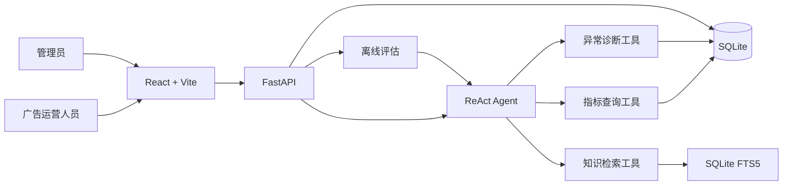

# AdOps Support Copilot

面向内部广告运营人员的智能投放诊断助手。系统使用模拟广告数据，通过 ReAct Agent 按需查询指标、执行异常规则和检索内部知识，并将结论、证据来源及安全的工具调用过程展示给用户。

> 本项目只提供分析建议，不修改真实广告计划；业务数据、阈值和知识规则均为模拟内容。

## 项目亮点

- **ReAct Agent 编排**：最多执行 5 步，根据问题选择指标查询、异常诊断或知识检索工具。
- **可信诊断**：指标由程序确定性计算，异常只使用已确认规则，LLM 负责组织回答而不是编造数据。
- **可追溯结果**：展示工具名称、非敏感参数、结果摘要、知识来源和 Trace ID，不暴露模型内部 Thought。
- **多轮与持久化**：缺少计划或日期时主动澄清，并将会话和消息保存到 SQLite。
- **安全降级**：模型不可用时返回确定性结果，并明确标记降级状态。
- **离线评估**：管理员可运行 15 条固定用例，评估意图、参数、指标、诊断、检索、澄清和工具选择，并对比历史批次。
- **运营概览**：按 `Asia/Shanghai` 汇总当天请求、完成、降级、失败、会话、反馈和最近评估结果。

## 系统架构



核心回答流程：

```text
用户问题 → 意图识别/参数检查 → ReActAgent 选择只读工具
        → 确定性数据或规则结果 → LLM 组织回答
        → 保存会话、处理记录和 Trace → 前端展示证据
```

## 技术栈

| 层级 | 技术 |
|---|---|
| 前端 | React、Vite、原生 CSS |
| 后端 | Python、FastAPI、Pydantic |
| Agent | hello-agents `0.2.0`、ReActAgent |
| 数据 | SQLite、FTS5 |
| 测试 | Python `unittest`、FastAPI TestClient |

## 功能模块

运营端支持指标查询、异常诊断、规则问答、参数澄清、历史会话、处理记录、回答反馈和 Agent 执行过程。

管理端支持当日系统概览、只读知识来源、离线评估批次运行、详情和对比。

## 本地运行

### 1. 环境要求

- Python 3.11+
- Node.js 20+
- 支持 OpenAI 兼容接口的大模型服务

### 2. 启动后端

```powershell
git clone https://github.com/00loveU/adops-support-copilot.git
cd "adops-support-copilot"

python -m venv .venv
Set-ExecutionPolicy -Scope Process -ExecutionPolicy RemoteSigned
.\.venv\Scripts\Activate.ps1
pip install -r requirements.txt
Copy-Item .env.example .env
```

编辑 `.env`：

```dotenv
LLM_API_KEY=你的API密钥
LLM_BASE_URL=https://你的兼容接口地址
LLM_MODEL_ID=你的模型名称
LLM_TIMEOUT=60
```

启动服务：

```powershell
python -m uvicorn backend.app.main:app --reload
```

接口文档：`http://127.0.0.1:8000/docs`

### 3. 启动前端

打开另一个 PowerShell：

```powershell
cd "adops-support-copilot\frontend"
npm install
npm run dev
```

访问 `http://127.0.0.1:5173`。Vite 会把 `/api` 请求代理到后端的 `8000` 端口。

## 演示账号

| 角色 | 用户名 | 密码 |
|---|---|---|
| 广告运营 | `operator1` | `Operator123!` |
| 系统管理员 | `admin1` | `Admin123!` |

演示账号仅用于本地模拟项目，不能直接用于真实生产环境。

## 推荐演示流程

1. 使用运营账号询问“CTR 是什么意思？”，查看知识来源和 Agent 执行过程。
2. 诊断 `CMP013` 在 `2026-09-08` 的异常，查看多规则命中、指标与建议。
3. 只输入“查询指标”，演示参数澄清和多轮会话。
4. 切换页面或刷新浏览器，确认会话仍然存在。
5. 使用管理员账号查看系统概览，并运行一次离线评估。

## 测试

```powershell
python -m unittest discover -s backend\tests -v

cd frontend
npm run build
```

当前本地验证结果：

- 后端 32 项测试通过。
- 前端生产构建通过。
- 真实模型离线评估 15/15 通过，未发生降级。

## 设计边界

- 不连接真实广告平台，仅使用模拟数据。
- 不执行预算、素材或投放状态修改。
- 第一版使用 SQLite FTS5，不引入向量数据库和 Reranker。
- 离线评估优先使用确定性评分，不使用 LLM Judge 改变核心通过率。
- 前端不展示模型隐藏推理过程。

详细设计请阅读 [ARCHITECTURE.md](ARCHITECTURE.md)、[BUSINESS_RULES.md](BUSINESS_RULES.md) 和 [DATA_API_CONTRACT.md](DATA_API_CONTRACT.md)。
